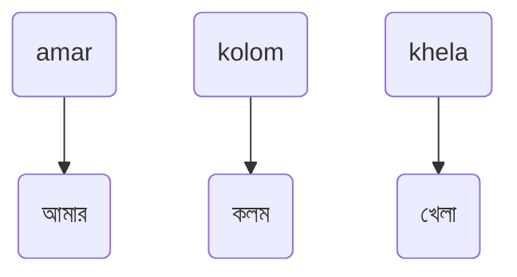
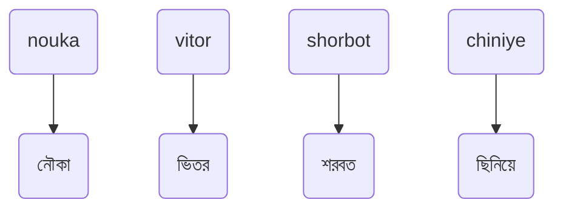
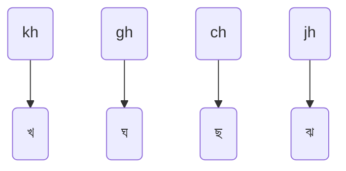
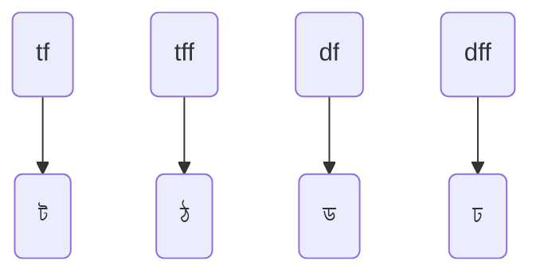
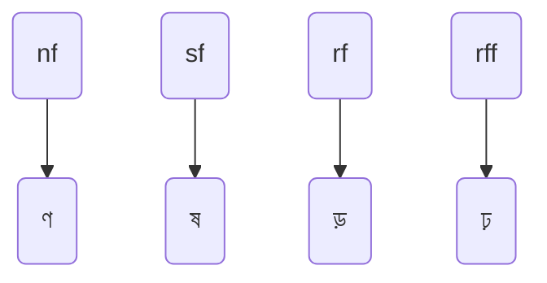
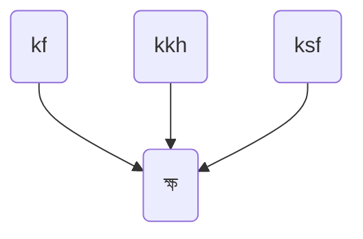
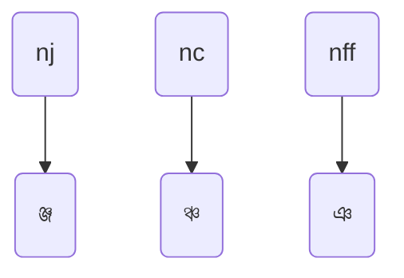
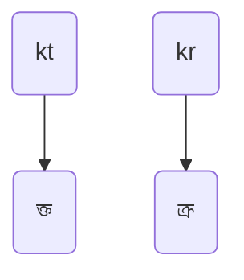
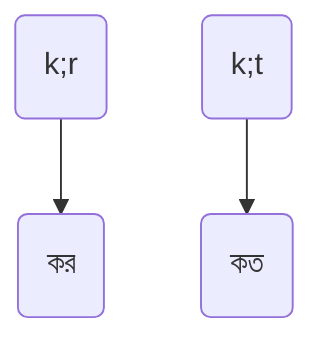
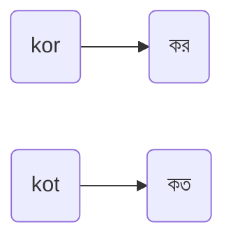

## ক্ষিপ্র কিবোর্ডের বিশেষত্ব
প্রচলিত ফোনেটিক হোক কিংবা ফিক্সড লেআউট হোক, উভয় ধরনের লেআউটের চেয়েই ক্ষিপ্র-তে দ্রুত লেখা যায়। ক্ষিপ্রর প্রধান আকর্ষণ যে ফিচারগুলো, সেগুলো জানতে এখানে ক্লিক করুন।

## ধাপ ১: সাধারণ বর্ণ লেখা
1. অধিকাংশ বর্ণকে কাছাকাছি উচ্চারণের বর্ণ দিয়ে লেখা যাবে।\
যেমন:

> [!TIP]
> `আ` লিখতে `a`, এবং, `এ` লিখতে `e` ব্যবহার করুন।

> [!NOTE]
> `অ্যা`এবং ` ্যা` লেখার বিশেষ ব্যবস্থা _ক্ষিপ্র_ -তে রয়েছে যেটা পরে উল্লেখ করা হবে।

**নিচের বর্ণগুলোকে হুবহু উচ্চারণ অনুসারে কিংবা, _অভ্র_ -এর মতো মেথডগুলোর অনুরূপ উপায়ে _ক্ষিপ্র_ -তে লেখা যায়:**
<details>
  <summary>টেবিল দেখতে এখানে ক্লিক করুন</summary>
    
| অ | আ, -া | ই, -ি | উ, -ু | এ, -ে | 
|---|------|------|------|------|
| o | a    | i    | u    | e    |

| ক | খ | গ | ঘ | ঙ    | চ | ছ | জ | ঝ |
|---|---|---|---|-------|---|---|---|---|
| k | kh| g | gh| ng | c | ch | j | jh |

| ত | থ | দ | ধ | ন |
|---|---|---|---|---|
| t | th| d | dh| n |

| প | ফ | ব | ভ | ম | য | র | ল | শ |
|---|---|---|---|---|---|---|---|---|
| p | ph| b | v | m | z | r | l | sh |

| স | হ | য় |
|---|---|---|
| s | h | y | 
</details>


এসব বর্ণ দিয়ে আরো কিছু সহজ ও কমন উদাহরণ:  



## ধাপ ২: অন্যান্য ব্যঞ্জনবর্ণ লেখা

### ধাপ ২.১: খ, ঘ, ছ, ঝ, ইত্যাদি মহাপ্রাণ বর্ণ লেখা (ভ ব্যতীত)
নিচের সাতটি মহাপ্রাণ বর্ণ লেখার জন্য h ব্যবহার করতে হবে:


```
flowchart TD
i(th) --> j(থ)
k(dh) --> l(ধ)
m(ph) --> n(ফ)
```

> [!NOTE]
> ভ, শ, ঠ, ঢ, ঢ় ইত্যাদি বর্ণ h দিয়ে লেখা যাবে না। এগুলো লেখা আমরা পরবর্তী ধাপে শিখব।

### ধাপ ২.৩: শ লেখা

## ধাপ ৩: মডিফায়ার
ক্ষিপ্র-তে f key কে মডিফায়ার হিসেবে রাখা হয়েছে। কিছু কিছু বর্ণের পরে f লিখে সেগুলোকে মডিফাই করা যাবে।\
মডিফায়ার ক্ষিপ্র-র একটি শক্তিশালী ফিচার। সামনে মডিফায়ারের অনেক গুলো উপযোগীতা ও উপকারীতা দেখতে পাবো আমরা।

## ধাপ ৪: ট, ঠ, ড, ঢ, ক্ষ, ইত্যাদি লিখতে মডিফায়ারের ব্যবহার
### ধাপ ৪.১: ট, ঠ, ড, ঢ, ণ, ষ, ড়, ঢ়, ইত্যাদি বর্ণ লেখা
* ত -এর পরে মডিফায়ার (f) ব্যবহার করে ট, ঠ;
* দ -এর পরে f ব্যবহার করে ড, ঢ;
* ন -এর পরে f দিয়ে ণ;
* স -এর পরে f দিয়ে ষ;
* এবং, র -এর পরে f দিয়ে ড়, ঢ় লেখা যাবে।
একবার অথবা দুইবার f লেখা লাগবে নিচের মতো:





### ধাপ ৪.২: ক্ষ
ক্ষ যুক্তবর্ণ (ক্ষ = ক + ষ = k + sf) হলেও এটা লেখার দুটো শর্টকাট আছে: kf, ও kkh



ক্ষ নিয়ে পূর্ণাঙ্গ আলোচনা আমাদের পূর্ণাঙ্গ ডকুমেন্টেশনে করা হয়েছে। (ক্লিক করুন)

### ধাপ ৪.৩: ঞ
ঞ লেখার জন্য প্রায় সর্বদাই n দিয়েই কাজ চলে যাবে। কেননা ঞ যুক্তবর্ণরূপে ছাড়া দেখা যায় না বললেই চলে।
তবুও মুক্ত রূপে ঞ লেখার জন্য nff ম্যাপিং রয়েছে।




## ধাপ ৪: অন্যান্য স্বরবর্ণ লেখা


## ধাপ ৪: যুক্তবর্ণ লেখা এবং এড়িয়ে যাওয়া
1. যুক্তবর্ণ গঠন সম্ভব এমন একাধিক বর্ণ একসাথে টাইপ করলে যুক্তবর্ণ গঠিত হয়ে যাবে।\
যেমন:



2. যুক্তবর্ণ এড়াতে বর্ণের মাঝে *পৃথায়ক* ব্যবহার করুন। ক্ষিপ্রতে সেমিকোলন `;` হলো *পৃথায়ক।*\
যেমন:  


3. পৃথায়কের পরিবর্তে `o` ব্যবহার করেও যুক্তবর্ণ এড়ানো যায়।\
যেমন:


> [!NOTE]
> সেমিকোলন `;` যেহেতু *পৃথায়ক*, তাই কোথাও সেমিকোলন লিখতে পরপর দুবার সেমিকোলন চাপুন।

যেমন: `sohoj;;` = `সহজ;`

> [!NOTE]
> প্রশ্ন হতে পারে; যুক্তবর্ণ এড়ানোয় `o` থাকা সত্ত্বেও *পৃথায়ক*-এর ধারণা কেন আনা হয়েছে। এতে কিছু সুবিধা রয়েছে, যা পরবর্তী ধাপগুলোর আলোচনায় উঠে আসবে।

## ধাপ ৫: স্বরবর্ণের বদলে কারচিহ্ন, কিংবা কারচিহ্নের বদলে স্বরবর্ণ লেখা

### ধাপ ৬: ক্ষিপ্র-র বিশেষ স্বরবর্ণ লেখা