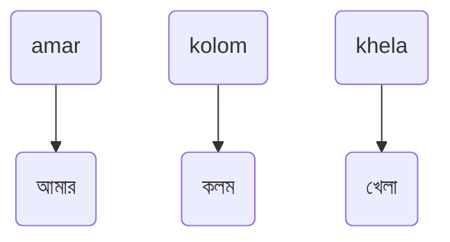
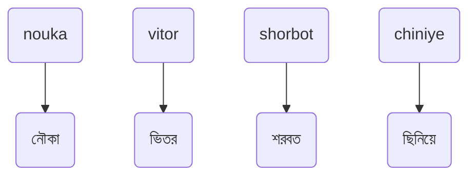
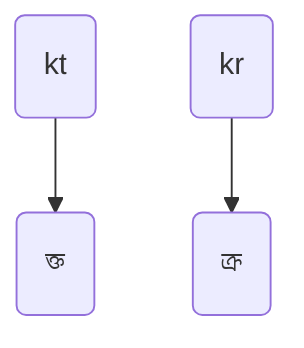
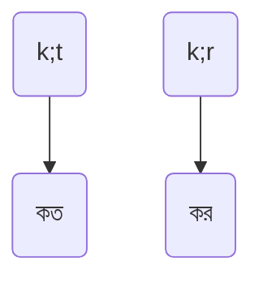
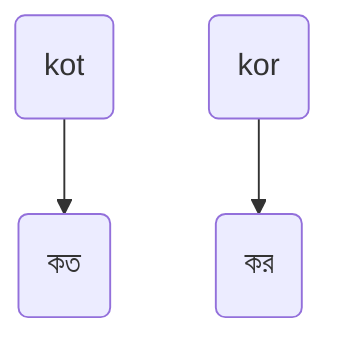
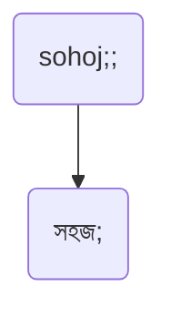

# ক্ষিপ্র কুইকস্টার্ট গাইড | ক্ষিপ্রসূচন
## ধাপ ১: সাধারণ বর্ণ লেখা
1. অধিকাংশ বর্ণকে কাছাকাছি উচ্চারণের বর্ণ দিয়ে লেখা যায়।\
যেমন:

> [!NOTE]
> লক্ষ্যণীয়, `া`কার লিখতে `a`, এবং, `ে`কার লিখতে `e` ব্যবহার করা হয়।

➡️ *অন্যান্য বিশেষ বিশেষ স্বর, এবং ব্যঞ্জন লেখা আমরা পরবর্তী ধাপগুলোয় শিখব।*

#### নিচের বর্ণগুলোকে হুবহু উচ্চারণ অনুসারে এবং, অভ্র - ইত্যাদি মেথডের অনুরূপ উপায়ে ক্ষিপ্রতে লেখা যায়:

<table allign="center">
  <tr>
  <td>ক</td>
  <td>খ</td>
  <td>গ</td>
  <td>ঘ</td>
  <td>ঙ</td>
  <td>চ</td>
  <td>ছ</td>
  <td>জ</td>
  <td>ঝ</td>
  </tr>

  <tr>
  <td>k</td>
  <td>kh</td>
  <td>g</td>
  <td>gh</td>
  <td>ng, $\textcolor{grey}{\textsf{ngf}}$</td>
  <td>c</td>
  <td>ch</td>
  <td>j</td>
  <td>jh</td>
  </tr>

  <tr>
  <td>ত</td>
  <td>থ</td>
  <td>দ</td>
  <td>ধ</td>
  <td>ন</td>
  </tr>

  <tr>
  <td>t</td>
  <td>th</td>
  <td>d</td>
  <td>dh</td>
  <td>n</td>
  </tr>

  <tr>
  <td>প</td>
  <td>ফ</td>
  <td>ব</td>
  <td>ভ</td>
  <td>ম</td>
  <td>য</td>
  <td>র</td>
  <td>ল</td>
  <td>শ</td>
  </tr>

  <tr>
  <td>p</td>
  <td>ph</td>
  <td>b</td>
  <td>v</td>
  <td>m</td>
  <td>z</td>
  <td>r</td>
  <td>l</td>
  <td>sh</td>
  </tr>

  <tr>
  <td>স</td>
  <td>হ</td>
  <td>য়</td>
  <td>ং</td>
  
  </tr>

  <tr>
  <td>s</td>
  <td>h</td>
  <td>y</td>
  <td>ng, $\textcolor{grey}{\textsf{oo}}$</td>
  
  </tr>

  <tr>
  <td>অ</td>
  <td>আ, া</td>
  <td>ই, ি</td>
  <td>উ, ু</td>
  
  <td>এ, ে</td>
  <td>ঐ, ৈ</td>
  <td>ঔ, ৌ</td>
  </tr>

  <tr>
  <td>o</td>
  <td>a</td>
  <td>i</td>
  <td>u</td>
  
  <td>e</td>
  <td>oi</td>
  <td>ou</td>
  </tr>

  

</table>

এসব বর্ণ দিয়ে আরো কিছু সহজ ও কমন উদাহরণ:  

## ধাপ ২: যুক্তবর্ণ লেখা এবং এড়িয়ে যাওয়া
1. যুক্তবর্ণ গঠন সম্ভব এমন একাধিক বর্ণ একসাথে টাইপ করলে যুক্তবর্ণ হয়ে যায়।\
যেমন:

2. যুক্তবর্ণ এড়াতে বর্ণের মাঝে *পৃথায়ক* ব্যবহার করুন। ক্ষিপ্রতে সেমিকোলন `;` হলো *পৃথায়ক।*\
যেমন:  

3. পৃথায়কের পরিবর্তে `o` ব্যবহার করেও যুক্তবর্ণ এড়ানো যায়।\
যেমন:

> [!NOTE]
> লক্ষ্যণীয়, সেমিকোলন `;` যেহেতু *পৃথায়ক*, তাই কোথাও সেমিকোলন লিখতে পরপর দুবার সেমিকোলন চাপুন।

যেমন:

> [!NOTE]
> প্রশ্ন হতে পারে; যুক্তবর্ণ এড়ানোয় `o` থাকা সত্ত্বেও *পৃথায়ক*-এর ধারণা কেন আনা হয়েছে। এতে কিছু সুবিধা রয়েছে, যা পরবর্তী ধাপগুলোর আলোচনায় উঠে আসবে।
