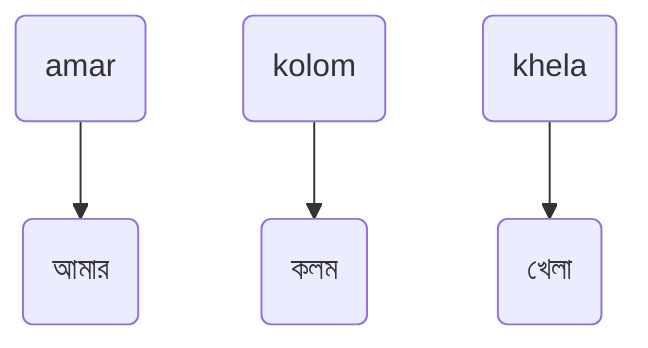
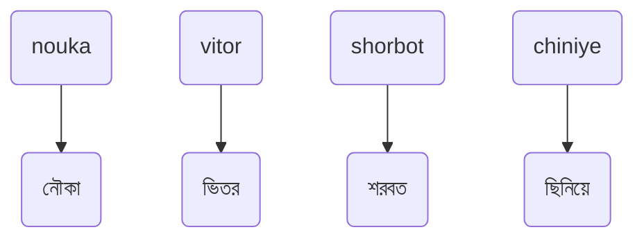
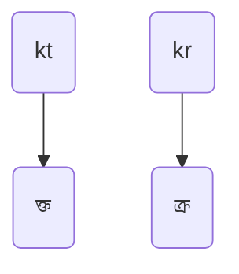
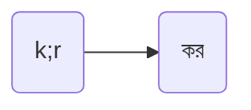
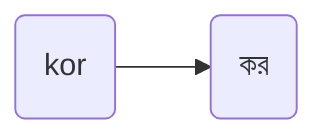
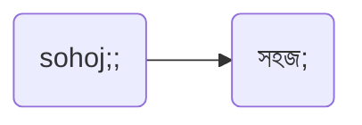

# _ক্ষিপ্র_ কুইকস্টার্ট গাইড | ক্ষিপ্রসূচন
## ধাপ ১: সাধারণ বর্ণ লেখা
1. অধিকাংশ বর্ণকে কাছাকাছি উচ্চারণের বর্ণ দিয়ে লেখা যায়।\
যেমন:

> [!TIP]
> `আ` লিখতে `a`, এবং, `এ` লিখতে `e` ব্যবহার করতে হয়।\
> `অ্যা`, ` ্যা` লেখারও বিশেষ ব্যবস্থা _ক্ষিপ্র_ -তে রয়েছে যেটা পরে উল্লেখ করা হবে।

#### নিচের বর্ণগুলোকে হুবহু উচ্চারণ অনুসারে এবং, _অভ্র_ - ইত্যাদি মেথডের অনুরূপ উপায়ে _ক্ষিপ্র_ -তে লেখা যায়:

  
তালিকা দেখতে ক্লিক করুন

    
| অ | আ, া | ই, ি | উ, ু | এ, ে | ঐ, ৈ | ঔ, ৌ |
|---|------|------|------|------|------|------|
| o | a    | i    | u    | e    | oi   | ou   |

| ক | খ | গ | ঘ | ঙ    | চ | ছ | জ | ঝ |
|---|---|---|---|-------|---|---|---|---|
| k | kh| g | gh| ng, $\textcolor{grey}{\textsf{ngf}}$ | c | ch | j | jh |

| ত | থ | দ | ধ | ন |
|---|---|---|---|---|
| t | th| d | dh| n |

| প | ফ | ব | ভ | ম | য | র | ল | শ |
|---|---|---|---|---|---|---|---|---|
| p | ph| b | v | m | z | r | l | sh |

| স | হ | য় | ং      |
|---|---|---|--------|
| s | h | y | ng, $\textcolor{grey}{\textsf{oo}}$ |

এসব বর্ণ দিয়ে আরো কিছু সহজ ও কমন উদাহরণ:  

## ধাপ ২: যুক্তবর্ণ লেখা এবং এড়িয়ে যাওয়া
1. যুক্তবর্ণ গঠন সম্ভব এমন একাধিক বর্ণ একসাথে টাইপ করলে যুক্তবর্ণ হয়ে যায়।\
যেমন:

2. যুক্তবর্ণ এড়াতে বর্ণের মাঝে *পৃথায়ক* ব্যবহার করুন। ক্ষিপ্রতে সেমিকোলন `;` হলো *পৃথায়ক।*\
যেমন:  

3. পৃথায়কের পরিবর্তে `o` ব্যবহার করেও যুক্তবর্ণ এড়ানো যায়।\
যেমন:

> [!NOTE]
> লক্ষ্যণীয়, সেমিকোলন `;` যেহেতু *পৃথায়ক*, তাই কোথাও সেমিকোলন লিখতে পরপর দুবার সেমিকোলন চাপুন।

যেমন:

> [!NOTE]
> প্রশ্ন হতে পারে; যুক্তবর্ণ এড়ানোয় `o` থাকা সত্ত্বেও *পৃথায়ক*-এর ধারণা কেন আনা হয়েছে। এতে কিছু সুবিধা রয়েছে, যা পরবর্তী ধাপগুলোর আলোচনায় উঠে আসবে।
